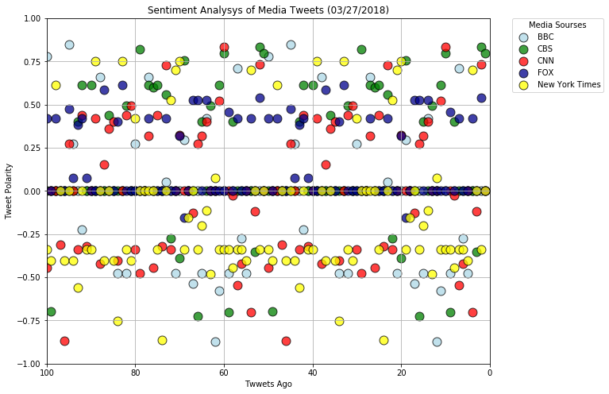
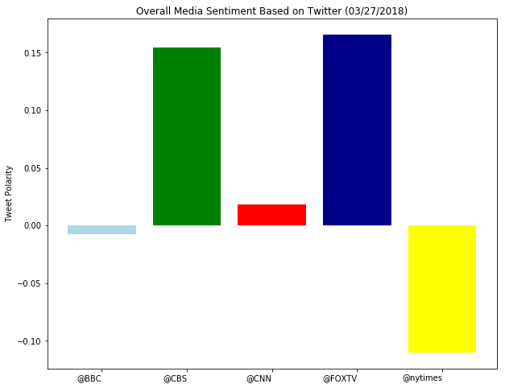

## Unit 7 | Assignment - Distinguishing Sentiments

## Background

__Twitter__ has become a wildly sprawling jungle of information&mdash;140 characters at a time.
Somewhere between 350 million and 500 million tweets are estimated to be sent out _per day_.
With such an explosion of data, on Twitter and elsewhere, it becomes more important than ever 
to tame it in some way, to concisely capture the essence of the data.


## News Mood

In this assignment, you'll create a Python script to perform a sentiment analysis of the Twitter activity of various news oulets, and to present your findings visually.


```python
# Dependencies
import numpy as np
import pandas as pd
import matplotlib.pyplot as plt
import json
import tweepy
import time
from datetime import datetime
import seaborn as sns
```


```python
# Import and Initialize Sentiment Analyzer
from vaderSentiment.vaderSentiment import SentimentIntensityAnalyzer
analyzer = SentimentIntensityAnalyzer()
```


```python
consumer_key = 'Nv7xOvlKyE0ix7LPEIrBH7PlS'
consumer_secret = 'VkJC8aFXNfAkVgnIvHY49UrBlEpnnCNgWsaQKMisNuQWQaVd0Q'
access_token = '974900600465797121-aGIrKeLxyzQYculD2K2rxI5X1ZVTYQa'
access_token_secret = 'U4UkVIsO5HCGT8YXUT2uAfekWdjvLBeBXOq1RYu5Z8XlK'

```


```python
# Setup Tweepy API Authentication
auth = tweepy.OAuthHandler(consumer_key, consumer_secret)
auth.set_access_token(access_token, access_token_secret)
api = tweepy.API(auth, parser=tweepy.parsers.JSONParser())
```


```python

```


```python
def sentiment_analyter (user):
    
    # Array to hold sentiment
    sentiment_dict = []
    sentiment_mean = [] 
    compound_list = []
    # Counter
    counter = 1
    all_tweets = []

# Loop through 2 times (total of 100 tweets)
    for x in range(2):
        if len(all_tweets) > 100:
            break

        # Run search around each tweet
        public_tweets = api.search(user, count=50, result_type="recent")

    # Loop through all tweets
        for tweet in public_tweets["statuses"]:
            all_tweets.append(tweet)

            # Run Vader Analysis on each tweet
            compound = analyzer.polarity_scores(tweet["text"])["compound"]
            pos = analyzer.polarity_scores(tweet["text"])["pos"]
            neu = analyzer.polarity_scores(tweet["text"])["neu"]
            neg = analyzer.polarity_scores(tweet["text"])["neg"]
            
            # Add each compound value to the compound array
            compound_list.append(compound)

 
                # Store the Average Sentiments
            sentiment_dict.append( {"User": user,
                                "Date": tweet["created_at"], 
                                "Compound": compound,
                                "Positive": pos,
                                "Negative": neg,
                                "Neutral": neu,
                                "Tweets Ago": counter})
                # Counter
            counter += 1
    sentiment_mean = {user: np.mean(compound_list)}       
    return sentiment_dict, sentiment_mean
```


```python
sentiment_dict_bbc,sentiment_mean_bbc = sentiment_analyter("@BBC")
sentiment_df_bbc = pd.DataFrame.from_dict(sentiment_dict_bbc)
#print(sentiment_mean_bbc)
#sentiment_df.head()
sentiment_df_bbc = sentiment_df_bbc.sort_values("Tweets Ago", ascending=False)
sentiment_df_bbc.reset_index(drop=True)
sentiment_df_bbc.head()
```


<div>
<style scoped>
    .dataframe tbody tr th:only-of-type {
        vertical-align: middle;
    }

    .dataframe tbody tr th {
        vertical-align: top;
    }

    .dataframe thead th {
        text-align: right;
    }
</style>
<table border="1" class="dataframe">
  <thead>
    <tr style="text-align: right;">
      <th></th>
      <th>Compound</th>
      <th>Date</th>
      <th>Negative</th>
      <th>Neutral</th>
      <th>Positive</th>
      <th>Tweets Ago</th>
      <th>User</th>
    </tr>
  </thead>
  <tbody>
    <tr>
      <th>99</th>
      <td>0.7783</td>
      <td>Tue Mar 27 23:10:06 +0000 2018</td>
      <td>0.0</td>
      <td>0.698</td>
      <td>0.302</td>
      <td>100</td>
      <td>@BBC</td>
    </tr>
    <tr>
      <th>98</th>
      <td>0.0000</td>
      <td>Tue Mar 27 23:10:07 +0000 2018</td>
      <td>0.0</td>
      <td>1.000</td>
      <td>0.000</td>
      <td>99</td>
      <td>@BBC</td>
    </tr>
    <tr>
      <th>97</th>
      <td>0.0000</td>
      <td>Tue Mar 27 23:10:46 +0000 2018</td>
      <td>0.0</td>
      <td>1.000</td>
      <td>0.000</td>
      <td>98</td>
      <td>@BBC</td>
    </tr>
    <tr>
      <th>96</th>
      <td>0.0000</td>
      <td>Tue Mar 27 23:10:59 +0000 2018</td>
      <td>0.0</td>
      <td>1.000</td>
      <td>0.000</td>
      <td>97</td>
      <td>@BBC</td>
    </tr>
    <tr>
      <th>95</th>
      <td>0.0000</td>
      <td>Tue Mar 27 23:11:04 +0000 2018</td>
      <td>0.0</td>
      <td>1.000</td>
      <td>0.000</td>
      <td>96</td>
      <td>@BBC</td>
    </tr>
  </tbody>
</table>
</div>


```python
# # Save the DataFrame as a csv
# sentiment_dict_bbc.to_csv("Media Analisys.csv",
#                      encoding="utf-8", index=False)
```


```python
sentiment_dict_cbs,sentiment_mean_cbs = sentiment_analyter("@CBS")
sentiment_df_cbs = pd.DataFrame.from_dict(sentiment_dict_cbs)
#sentiment_df.head()
sentiment_df_cbs = sentiment_df_cbs.sort_values("Tweets Ago", ascending=False)
sentiment_df_cbs.reset_index(drop=True)
sentiment_df_cbs.head()
```


<div>
<style scoped>
    .dataframe tbody tr th:only-of-type {
        vertical-align: middle;
    }

    .dataframe tbody tr th {
        vertical-align: top;
    }

    .dataframe thead th {
        text-align: right;
    }
</style>
<table border="1" class="dataframe">
  <thead>
    <tr style="text-align: right;">
      <th></th>
      <th>Compound</th>
      <th>Date</th>
      <th>Negative</th>
      <th>Neutral</th>
      <th>Positive</th>
      <th>Tweets Ago</th>
      <th>User</th>
    </tr>
  </thead>
  <tbody>
    <tr>
      <th>99</th>
      <td>0.0000</td>
      <td>Tue Mar 27 23:09:47 +0000 2018</td>
      <td>0.000</td>
      <td>1.000</td>
      <td>0.000</td>
      <td>100</td>
      <td>@CBS</td>
    </tr>
    <tr>
      <th>98</th>
      <td>-0.6956</td>
      <td>Tue Mar 27 23:10:20 +0000 2018</td>
      <td>0.346</td>
      <td>0.466</td>
      <td>0.188</td>
      <td>99</td>
      <td>@CBS</td>
    </tr>
    <tr>
      <th>97</th>
      <td>0.0000</td>
      <td>Tue Mar 27 23:10:48 +0000 2018</td>
      <td>0.000</td>
      <td>1.000</td>
      <td>0.000</td>
      <td>98</td>
      <td>@CBS</td>
    </tr>
    <tr>
      <th>96</th>
      <td>0.0000</td>
      <td>Tue Mar 27 23:11:11 +0000 2018</td>
      <td>0.000</td>
      <td>1.000</td>
      <td>0.000</td>
      <td>97</td>
      <td>@CBS</td>
    </tr>
    <tr>
      <th>95</th>
      <td>0.0000</td>
      <td>Tue Mar 27 23:11:29 +0000 2018</td>
      <td>0.000</td>
      <td>1.000</td>
      <td>0.000</td>
      <td>96</td>
      <td>@CBS</td>
    </tr>
  </tbody>
</table>
</div>


```python
# # Save the DataFrame as a csv
# sentiment_dict_cbs.to_csv("Media Analisys.csv", mode='a', header=False
#                      encoding="utf-8", index=False)
result_df = sentiment_df_bbc.append(sentiment_df_cbs)
```


```python
sentiment_dict_cnn,sentiment_mean_cnn = sentiment_analyter("@CNN")
sentiment_df_cnn = pd.DataFrame.from_dict(sentiment_dict_cnn)
#sentiment_df.head()
sentiment_df_cnn = sentiment_df_cnn.sort_values("Tweets Ago", ascending=False)
sentiment_df_cnn.reset_index(drop=True)
sentiment_df_cnn.head()
```


<div>
<style scoped>
    .dataframe tbody tr th:only-of-type {
        vertical-align: middle;
    }

    .dataframe tbody tr th {
        vertical-align: top;
    }

    .dataframe thead th {
        text-align: right;
    }
</style>
<table border="1" class="dataframe">
  <thead>
    <tr style="text-align: right;">
      <th></th>
      <th>Compound</th>
      <th>Date</th>
      <th>Negative</th>
      <th>Neutral</th>
      <th>Positive</th>
      <th>Tweets Ago</th>
      <th>User</th>
    </tr>
  </thead>
  <tbody>
    <tr>
      <th>99</th>
      <td>-0.4466</td>
      <td>Tue Mar 27 23:20:31 +0000 2018</td>
      <td>0.164</td>
      <td>0.836</td>
      <td>0.000</td>
      <td>100</td>
      <td>@CNN</td>
    </tr>
    <tr>
      <th>98</th>
      <td>0.0000</td>
      <td>Tue Mar 27 23:20:31 +0000 2018</td>
      <td>0.000</td>
      <td>1.000</td>
      <td>0.000</td>
      <td>99</td>
      <td>@CNN</td>
    </tr>
    <tr>
      <th>97</th>
      <td>0.0000</td>
      <td>Tue Mar 27 23:20:32 +0000 2018</td>
      <td>0.000</td>
      <td>1.000</td>
      <td>0.000</td>
      <td>98</td>
      <td>@CNN</td>
    </tr>
    <tr>
      <th>96</th>
      <td>-0.3094</td>
      <td>Tue Mar 27 23:20:33 +0000 2018</td>
      <td>0.173</td>
      <td>0.707</td>
      <td>0.121</td>
      <td>97</td>
      <td>@CNN</td>
    </tr>
    <tr>
      <th>95</th>
      <td>-0.8658</td>
      <td>Tue Mar 27 23:20:33 +0000 2018</td>
      <td>0.350</td>
      <td>0.650</td>
      <td>0.000</td>
      <td>96</td>
      <td>@CNN</td>
    </tr>
  </tbody>
</table>
</div>


```python
# # Save the DataFrame as a csv
# sentiment_dict_cnn.to_csv("Media Analisys.csv", mode='a', header=False
#                      encoding="utf-8", index=False)
result_df = result_df.append(sentiment_df_cnn)
```


```python
sentiment_dict_fox,sentiment_mean_fox = sentiment_analyter("@FOXTV")
sentiment_df_fox = pd.DataFrame.from_dict(sentiment_dict_fox)
#sentiment_df.head()
sentiment_df_fox = sentiment_df_fox.sort_values("Tweets Ago", ascending=False)
sentiment_df_fox.reset_index(drop=True)
sentiment_df_fox.head()
```


<div>
<style scoped>
    .dataframe tbody tr th:only-of-type {
        vertical-align: middle;
    }

    .dataframe tbody tr th {
        vertical-align: top;
    }

    .dataframe thead th {
        text-align: right;
    }
</style>
<table border="1" class="dataframe">
  <thead>
    <tr style="text-align: right;">
      <th></th>
      <th>Compound</th>
      <th>Date</th>
      <th>Negative</th>
      <th>Neutral</th>
      <th>Positive</th>
      <th>Tweets Ago</th>
      <th>User</th>
    </tr>
  </thead>
  <tbody>
    <tr>
      <th>99</th>
      <td>0.4199</td>
      <td>Tue Mar 27 22:48:09 +0000 2018</td>
      <td>0.0</td>
      <td>0.787</td>
      <td>0.213</td>
      <td>100</td>
      <td>@FOXTV</td>
    </tr>
    <tr>
      <th>98</th>
      <td>0.0000</td>
      <td>Tue Mar 27 22:48:09 +0000 2018</td>
      <td>0.0</td>
      <td>1.000</td>
      <td>0.000</td>
      <td>99</td>
      <td>@FOXTV</td>
    </tr>
    <tr>
      <th>97</th>
      <td>0.4199</td>
      <td>Tue Mar 27 22:48:09 +0000 2018</td>
      <td>0.0</td>
      <td>0.787</td>
      <td>0.213</td>
      <td>98</td>
      <td>@FOXTV</td>
    </tr>
    <tr>
      <th>96</th>
      <td>0.0000</td>
      <td>Tue Mar 27 22:48:51 +0000 2018</td>
      <td>0.0</td>
      <td>1.000</td>
      <td>0.000</td>
      <td>97</td>
      <td>@FOXTV</td>
    </tr>
    <tr>
      <th>95</th>
      <td>0.0000</td>
      <td>Tue Mar 27 22:49:51 +0000 2018</td>
      <td>0.0</td>
      <td>1.000</td>
      <td>0.000</td>
      <td>96</td>
      <td>@FOXTV</td>
    </tr>
  </tbody>
</table>
</div>


```python
# # Save the DataFrame as a csv
# sentiment_dict_fox.to_csv("Media Analisys.csv", mode='a', header=False
#                      encoding="utf-8", index=False)
result_df = result_df.append(sentiment_df_fox)
```


```python
sentiment_dict_nytimes,sentiment_mean_nytimes = sentiment_analyter("@nytimes")
sentiment_df_nytimes = pd.DataFrame.from_dict(sentiment_dict_nytimes)
#sentiment_df.head()
sentiment_df_nytimes = sentiment_df_nytimes.sort_values("Tweets Ago", ascending=False)
sentiment_df_nytimes.reset_index(drop=True)
sentiment_df_nytimes.head()
```


<div>
<style scoped>
    .dataframe tbody tr th:only-of-type {
        vertical-align: middle;
    }

    .dataframe tbody tr th {
        vertical-align: top;
    }

    .dataframe thead th {
        text-align: right;
    }
</style>
<table border="1" class="dataframe">
  <thead>
    <tr style="text-align: right;">
      <th></th>
      <th>Compound</th>
      <th>Date</th>
      <th>Negative</th>
      <th>Neutral</th>
      <th>Positive</th>
      <th>Tweets Ago</th>
      <th>User</th>
    </tr>
  </thead>
  <tbody>
    <tr>
      <th>99</th>
      <td>-0.3400</td>
      <td>Tue Mar 27 23:20:01 +0000 2018</td>
      <td>0.103</td>
      <td>0.897</td>
      <td>0.000</td>
      <td>100</td>
      <td>@nytimes</td>
    </tr>
    <tr>
      <th>98</th>
      <td>-0.4019</td>
      <td>Tue Mar 27 23:20:01 +0000 2018</td>
      <td>0.130</td>
      <td>0.870</td>
      <td>0.000</td>
      <td>99</td>
      <td>@nytimes</td>
    </tr>
    <tr>
      <th>97</th>
      <td>0.6124</td>
      <td>Tue Mar 27 23:20:02 +0000 2018</td>
      <td>0.000</td>
      <td>0.688</td>
      <td>0.312</td>
      <td>98</td>
      <td>@nytimes</td>
    </tr>
    <tr>
      <th>96</th>
      <td>0.0000</td>
      <td>Tue Mar 27 23:20:03 +0000 2018</td>
      <td>0.000</td>
      <td>1.000</td>
      <td>0.000</td>
      <td>97</td>
      <td>@nytimes</td>
    </tr>
    <tr>
      <th>95</th>
      <td>-0.4019</td>
      <td>Tue Mar 27 23:20:03 +0000 2018</td>
      <td>0.130</td>
      <td>0.870</td>
      <td>0.000</td>
      <td>96</td>
      <td>@nytimes</td>
    </tr>
  </tbody>
</table>
</div>


```python
# # Save the DataFrame as a csv
# sentiment_dict_nytimes.to_csv("Media Analisys.csv", mode='a', header=False
#                      encoding="utf-8", index=False)
result_df = result_df.append(sentiment_df_nytimes)
result_df.to_csv("Media Analisys.csv", encoding="utf-8", index=False )
```


```python
#plt_bbc = 
bbc = plt.scatter(sentiment_df_bbc["Tweets Ago"],sentiment_df_bbc["Compound"], s=120, facecolor='lightblue',
                   edgecolors="black",alpha=0.75, label = 'BBC')
cbs = plt.scatter(sentiment_df_cbs["Tweets Ago"],sentiment_df_cbs["Compound"], s=120, facecolor='green',
                   edgecolors="black",alpha=0.75, label = 'CBS')
cnn = plt.scatter(sentiment_df_cnn["Tweets Ago"],sentiment_df_cnn["Compound"], s=120, facecolor='red',
                   edgecolors="black",alpha=0.75, label = 'CNN')
fox = plt.scatter(sentiment_df_fox["Tweets Ago"],sentiment_df_fox["Compound"], s=120, facecolor='darkblue',
                   edgecolors="black",alpha=0.75, label = 'FOX')
nytimes = plt.scatter(sentiment_df_nytimes["Tweets Ago"],sentiment_df_nytimes["Compound"], s=120, facecolor='yellow',
                   edgecolors="black",alpha=0.75, label = 'New York Times')
plt.legend(handles=[bbc, cbs, cnn, fox,nytimes], title="Media Sourses", bbox_to_anchor=(1.05, 1), loc=2, borderaxespad=0.)
fig_size = plt.rcParams["figure.figsize"]
fig_size[0] = 10
fig_size[1] = 8
plt.ylim(-1,1)
plt.xlim(100,0)
plt.grid(True)
plt.title("Sentiment Analysys of Media Tweets (03/27/2018)")
plt.xlabel("Twwets Ago")
plt.ylabel("Tweet Polarity")
plt.savefig("SentimentAnalisysOfMedia.png")
plt.show()
```





## Bar Plot: Sentiment analysys of media


```python
result_dict ={**sentiment_mean_bbc, **sentiment_mean_cbs, **sentiment_mean_cnn, 
              **sentiment_mean_fox, **sentiment_mean_nytimes}

result_df = pd.DataFrame.from_dict([result_dict] )

```


```python
y_value = result_df.iloc[0, :]
y_value
```


    @BBC       -0.007600
    @CBS        0.154416
    @CNN        0.018352
    @FOXTV      0.165872
    @nytimes   -0.110348
    Name: 0, dtype: float64


```python
#target_terms = ("@BBC", "@CBS", "@CNN","@FOXTV", "@nytimes")
colors = ('lightblue', 'green','red', 'darkblue', 'yellow')
tick_locations = np.arange(len(result_df.columns))                           
plt.bar(np.arange(len(result_df.columns)), y_value,  color=colors,  align="center")
plt.xticks(tick_locations, result_df.columns, ha="right")
plt.title("Overall Media Sentiment Based on Twitter (03/27/2018)")
plt.ylabel("Tweet Polarity")
plt.savefig("TweetPolarity.png")
plt.show()
```





* Include a written description of three observable trends based on the data. 
According to VADER analysis on 03/27/2018 news media organizations:
1. CBS, CNN, and Fox have more positive sentiments
2. BBS and NY Times have more negative sentiments
3. CBS has most positive average compount sentiments


```python

```
